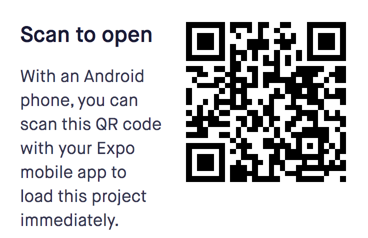

# ci-cd-showcase-rn

https://expo.io/@taogilaaa/ci-cd-showcase-rn



A repository containing implementation of expo deployments + continuous integration + continuous deployment for frontend (react native), the goal is to showcase the benefits of these workflow

## Prerequisites

This project requires

- [nodejs](https://nodejs.org/en/)
- [yarn](https://yarnpkg.com/en/docs/install)

## Getting Started

### Installation

Use the package manager [yarn](https://yarnpkg.com/en/docs/install) to install dependencies.

```bash
yarn
```

### Example

Examples can be found on this project's [pull request](https://github.com/taogilaaa/ci-cd-showcase-rn/pulls?utf8=%E2%9C%93&q=is%3Apr)

* [Add custom icon on landing screen](https://github.com/taogilaaa/ci-cd-showcase-rn/pull/2)

### Deployment

* Create a feature branch, and push the commits to this repo, the CI runner will run and detect changes, and deploy the artifacts to [expo][expo]

## Test it yourself

### Using this Repository

1. Create a new branch and push the commits here
2. [Optional] Create a new pull request!

### Using a Fork

1. Fork this repository
2. Create github [access token][github token] to allow [travis ci][travis] to access repo and write to discussions
  
  
3. Register [expo account](https://expo.io/login)
4. Setup your repository settings on travis ci https://travis-ci.com/USER_NAME/REPO_NAME/settings and add `GITHUB_TOKEN`, `EXP_USERNAME`, `EXP_PASSWORD`, `GITHUB_USERNAME`
  
5. Make a commit and push it !

[travis]: https://travis-ci.com/
[expo]: https://expo.io/
[github token]: https://github.com/settings/tokens
